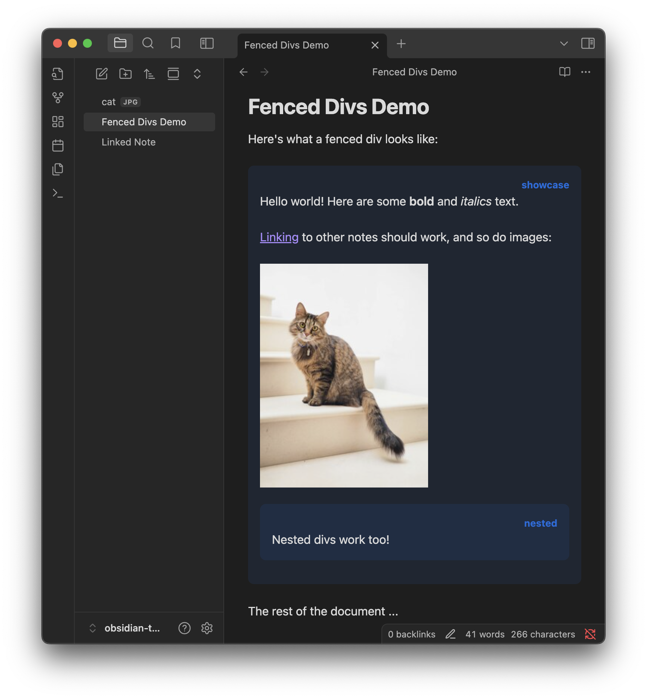
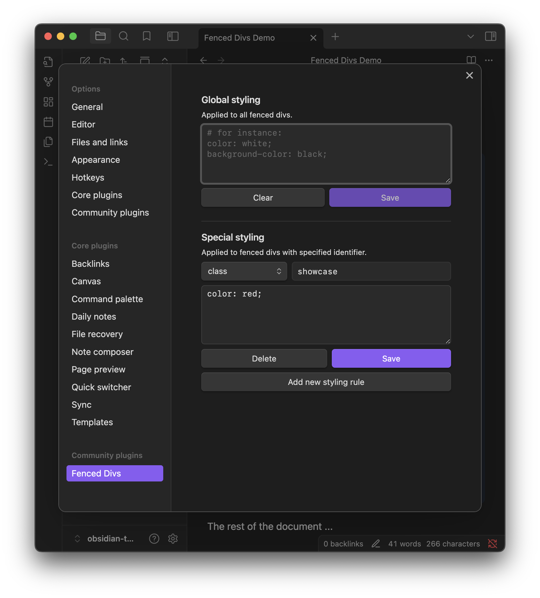

# Fenced Divs for Obsidian

This Obsidian plugin adds support for the [special fenced div syntax for Pandoc Markdown](https://pandoc.org/chunkedhtml-demo/8.18-divs-and-spans.html#extension-fenced_divs):

```
::: showcase

Hello world! Here are some **bold** and *italics* text.

[[Linked Note|Linking]] to other notes should work, and so do images:


::: nested
Nested divs work too!
:::

:::
```



> [!NOTE]
> This plugin currently does not support rendering fenced divs in Reading Mode,
> since `MarkdownPostProcessor` does not preserve linebreaks.

## Settings

Because fenced divs are rendered as regular HTML `div`s, you should be able to style them with [Obsidian CSS snippets](https://help.obsidian.md/snippets). Alternatively, you can apply settings directly to `style` attributes through the plugin settings:



## Development

To install dependencies:

```bash
npm install
```

Running tests:

```bash
npm test
```

To compile:

```bash
npm run dev
```

To build for production:

```bash
npm run build
```
